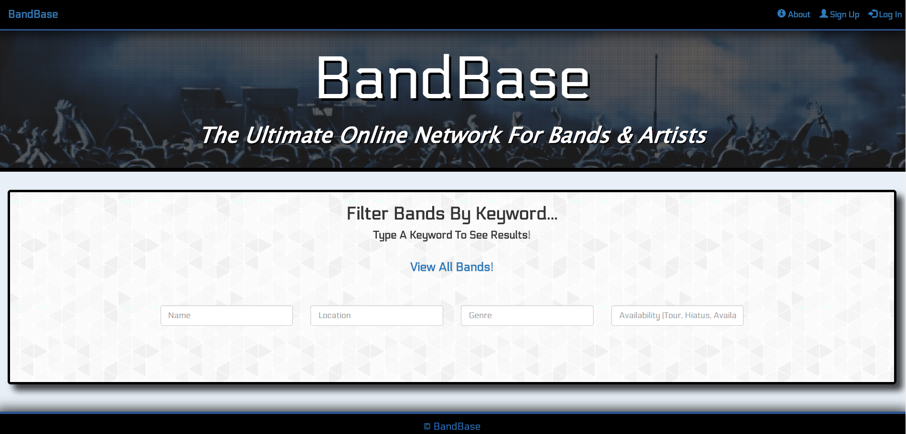
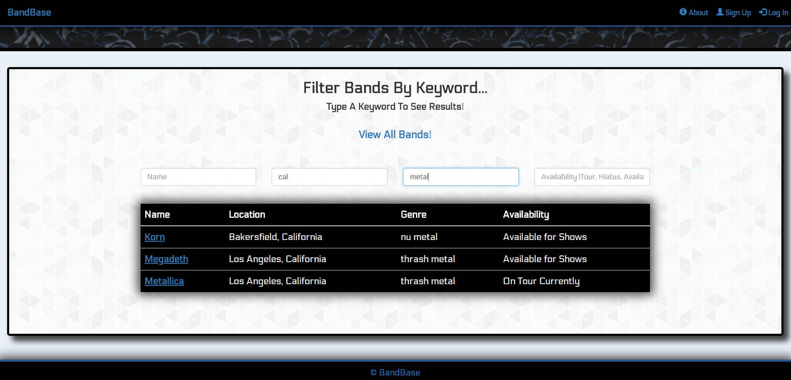
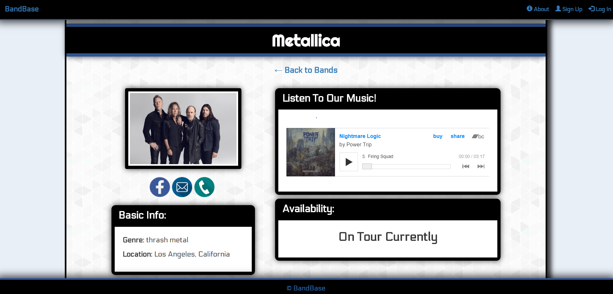

# BandBase 

**The home page of the app, ready for users to filter bands:**

**Result after a user has implemented chosen filters:**

[View Live!](https://mighty-ridge-41365.herokuapp.com/)

## General Description:
BandBase is a one of a kind app that allows bands/artists from around the country to connect with one another in order to book shows together if they plan to go on tour in a particular area. Promoters can use the database as well to find artists in specific locations who play specific genres of music, which will then help them get in contact with these artists to book them for gigs.

BandBase allows visitors, as well as registered members, to filter for a specific artist based on Artist Name, Location, Genre, & Availability (which comes in 3 options: On Tour Currently, On Hiatus, & Available for Shows).

In order to submit your information to the database, click "Sign Up" to create a new account for your band. Once you're registered, you can Log In and update or delete your profile.
  
## Motivation: 
Currently-existing music networking sites don’t allow artists to easily filter one another by genre & location simultaneously. Our app solves the issues that many artists have when they wish to go on tour in a particular part of the country at a particular time and don’t know which other musicians are available, who play the same genre of music.

**A sample profile page:**

## Technologies Used:

* ReactJS
* ExpressJS
* NodeJS
* MongoDB
* MongooseJS
* APIs/Routing
* PassportJS
* JavaScript
* HTML
* CSS
* Bootstrap/React Bootstrap
* Heroku

## Team Roles: 

**Isaac:** 

* implemented user authentication with **PassportJS**
* ensured that the filters worked properly to allow **filtering** on multiple fields simultaneously
* contributed to **ReactJS** functionality
* contributed overall big picture idea for the project
* handled some of the **API/Server Routing** & **MongoDB** structure
* contributed to **Front-End design**

**Dennis:** 

* developed overall **ReactJS** structural foundation for the app
* developed the “Update Profile” & “Delete Profile” capabilities
* implemented **filters**
* handled **error validation** upon new user creation
* developed **MongoDB** structure
* handled some of the **API/Server Routing**
* contributed to **Front-End design**
* handled deployment of app to **Heroku**

**Matt:**

* contributed to the **Front-End styling** using **CSS** & **React Bootstrap**
* handled modal functions
* assisted with **ReactJS** components/functionality
* worked to ensure **mobile responsiveness**

## Challenges:

**Isaac:**

* 
* 
* 

**Dennis:**

* **Error handling** was very challenging because it needed to function both on the Front-End, to prevent incorrect formats from being submitted, and on the Back-End, in order to check for duplicate submissions. I had to figure out how to check for errors using **ReactJS** state, and also how to send back error messages from the server and then display them to the user.

* **Routing** was at times challenging because the app uses so many different routes & routing-related files that interact with one another. I made sure I understood the routing structure and how exactly the app was communicating with the server to ensure that I could work with the routes and **API** requests properly.

* **Updating profiles** was a challenge because I needed to figure out a way to only modify the fields in the database that the user was trying to edit, without having all the other fields save as blank due to the user not typing anything into their edit boxes. I solved this problem by experimenting with different ways to have the data sent from the ReactJS Front-End component to the API until I found a way that logically made sense and was effective.

**Matt:**

* 
* 
* 

## Future Improvements:

* Implement an automated email system that sends users emails after a certain amount of time that they haven’t logged in and if they don’t reply, automatically delete their accounts
* “Forgot password” feature
* Implement more types of filters (i.e. “signed or independent”, etc)
* Allow users to post band updates on their accounts
